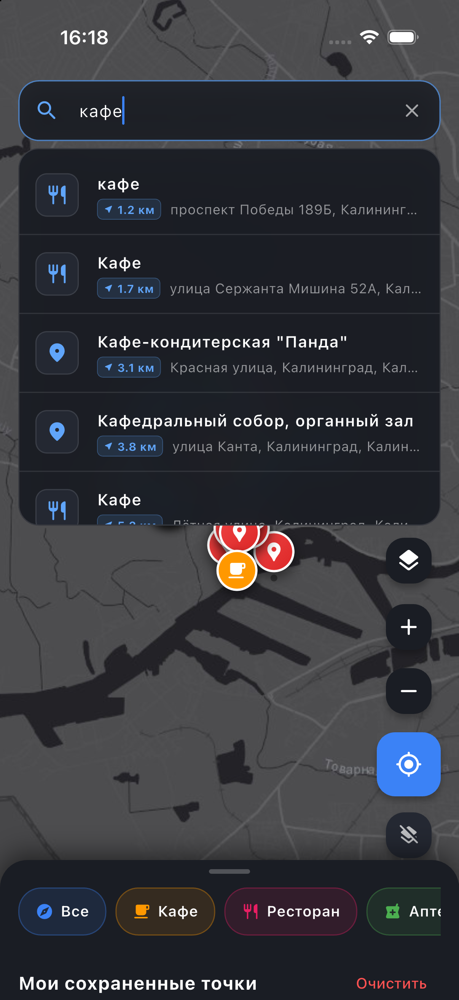
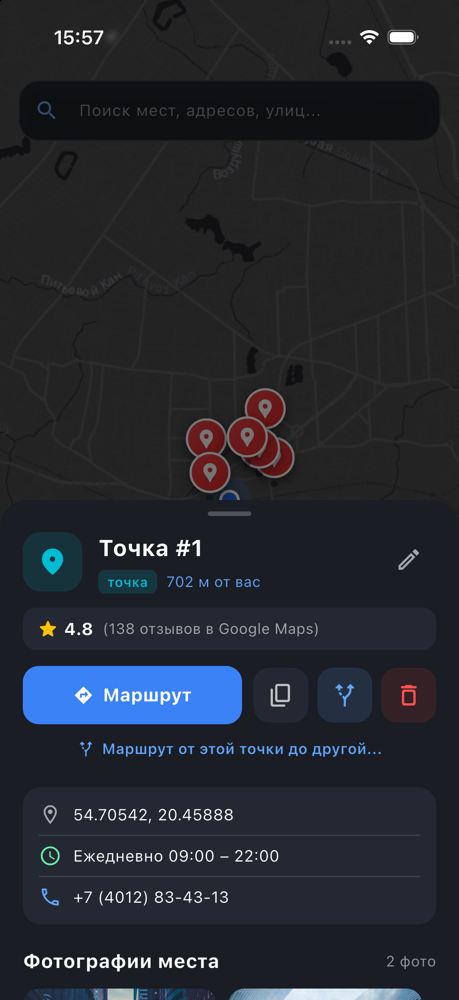
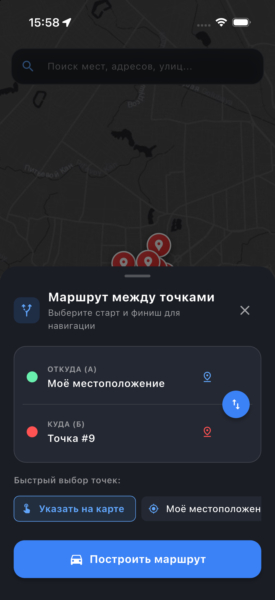
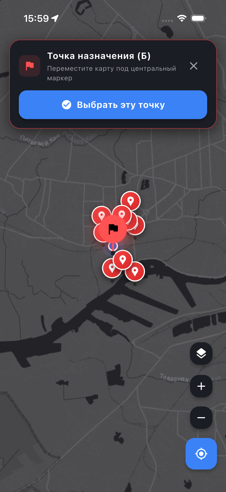

# 🗺️ Maps — Премиальное мобильное приложение карт нового поколения

[](https://flutter.dev)
[](https://dart.dev)
[](https://flutter.dev)
[](https://www.openstreetmap.org)
[](LICENSE)

Высокопроизводительное кроссплатформенное мобильное приложение карт в премиальном стиле **Cyberpunk Dark Glassmorphism**. Построено на стеке Flutter + OpenStreetMap + OSRM + Overpass API + Photon Geocoding с поддержкой интерактивного выбора точек на карте, реальных фото мест и отзывов в стиле Google Maps.

---

## 📱 Скриншоты интерфейса

| Карта и POI | Поиск рядом (GPS) | Карточка заведения | Маршруты (А ➔ Б) | Выбор на карте |
|:---:|:---:|:---:|:---:|:---:|
|  |  |  |  |  |

---

## ✨ Ключевые возможности

### 🔍 Умный геопоиск, привязанный к геолокации
- **Жесткая привязка к координатам пользователя**: поисковые запросы всегда центрируются на текущей позиции GPS, исключая нерелевантные объекты из других стран или городов.
- **Сортировка по удаленности**: ближайшие заведения и адреса всегда отображаются первыми в списке.
- **Индикаторы расстояния**: неоновый бейдж с точной дистанцией (`📍 180 м`, `📍 1.2 км`) у каждого найденного места.
- **Быстрые категории и места вокруг**: при нажатии на строку поиска мгновенно появляются чипы категорий (*Кафе, Магазины, Аптеки, АЗС, Рестораны*) и список заведений в шаговой доступности.

### 🎯 Интерактивный выбор точек на карте («Point Picker»)
- **Свободный выбор любой географической точки**: при планировании маршрута можно выбрать старт (А) или финиш (Б) не только из каталога или GPS, но и **прямо на карте**.
- **Плавающий прицел по центру экрана**: перемещайте карту под центральный пин с плавной анимацией и тактильной отдачей (Haptic Feedback).
- **Стеклянная панель управления**: плавающий блюр-баннер вверху экрана с подсказкой, кнопкой подтверждения выбранной точки и быстрой отменой.

### 🚗 Умная навигация и планировщик маршрутов (А ➔ Б)
- **Автомобильная маршрутизация OSRM**: расчет оптимального маршрута, дистанции (км/м) и точного времени в пути.
- **Любые комбинации точек**:
  - `Моё местоположение (GPS)` ➔ `Выбранное заведение`
  - `Точка на карте` ➔ `Сохраненная метка`
  - `Сохраненная метка` ➔ `Точка на карте`
- **Быстрый реверс (Swap ⇄)**: моментальная смена направления движения одной кнопкой.
- **Информационная карточка маршрута**: неоновая полилиния на карте, автоматический зум камеры на весь маршрут и кнопка сброса.

### 🛰️ Качественные слои карты (Без водяных знаков)
- **4 стиля отображения карты**:
  - `Esri Dark Gray Base` — стильная, чистая темная картографическая подложка **без раздражающих водяных знаков**.
  - `OpenStreetMap Standard` — классическая детальная топооснова.
  - `Esri World Imagery` — детальные спутниковые снимки высокого разрешения.
  - `CyclOSM` — велосипедные и пешеходные дорожки.
- **Оффлайн-кэширование тайлов**: интеграция `flutter_map_cache` и `dio_cache_interceptor` (кэширование во внутреннее хранилище устройства, моментальная подгрузка и экономия трафика).
- **Плавное управление**: жесты масштабирования, вращения, зум-кнопки и центрирование.

### ⭐ Карточки заведений в стиле Google Maps
- **Реальные фотографии заведений**: галерея интерьеров и фасадов высокого разрешения (Unsplash CDN) с полноэкранным просмотром по тапу.
- **Отзывы пользователей Google Карты**:
  - Рейтинг заведения и число отзывов.
  - Аватарки пользователей, бейджи «Знаток города», даты и текст отзывов.
- **Полезная информация**: статус работы (*Круглосуточно*, *08:00 – 23:00*), телефон, адрес.
- **Быстрые действия**: построение маршрута, выбор для навигации, копирование точных координат в буфер обмена.

### 🏪 Отказоустойчивый Overpass API
- **Overpass API с защитой от 504**: пул зеркал (`lz4.overpass-api.de`, `overpass-api.de`, `z.overpass-api.de`) с автоматическим переключением при сбоях и оффлайн-кэшем.
- **Категории мест**: Кафе, Рестораны, Аптеки, Магазины, АЗС.

### 💎 Премиальный UI/UX: Dark Glassmorphism
- Использование аппаратного размытия `BackdropFilter` (frosted glass).
- Акцентная неоновая подсветка, плавные всплывающие шторки, аккуратная типографика.
- Полная адаптивность под iOS Dynamic Island / Safe Area и Android.

---

## 🏛️ Архитектура проекта

Проект организован по принципам **Clean Architecture** с разделением ответственности:

```
lib/
├── app_theme.dart                 # Единая дизайн-система (цвета, Dark Glass, типографика)
├── main.dart                      # Точка входа в приложение
├── main_screen.dart               # Главный контроллер экрана карты и координатор UI
│
├── models/                        # Неизменяемые модели данных
│   ├── map_tile_style.dart        # Стили и провайдеры тайлов карты
│   ├── place.dart                 # Модель заведения / объекта POI
│   ├── place_review.dart          # Модель отзыва Google Maps
│   ├── route_info.dart            # Информация о маршруте (геометрия, время, дистанция)
│   ├── saved_marker.dart          # Пользовательская сохраненная точка
│   └── search_result.dart         # Результат поисковой подсказки Photon
│
├── services/                      # Сервисный слой (сеть, GPS, хранилище)
│   ├── location_service.dart      # Сервис GPS геолокации и разрешений
│   ├── marker_storage.dart        # Хранилище меток (SharedPreferences)
│   ├── place_details_service.dart # Обогащение мест фотогалереями и отзывами
│   ├── places_service.dart        # Overpass API (пул зеркал + кэш + fallback)
│   ├── routing_service.dart       # OSRM автомобильная маршрутизация между любыми точками
│   └── search_service.dart        # Photon геокодинг с автодополнением
│
└── widgets/                       # Переиспользуемые компоненты интерфейса
    ├── bottom_panel.dart          # Нижняя шторка (категории заведений, список меток)
    ├── layer_switcher_dialog.dart # Диалог смены слоя карты
    ├── map_marker_widgets.dart    # Виджеты маркеров на карте (GPS, пины, заведения)
    ├── place_details_sheet.dart   # Детальная карточка места (фото, отзывы, действия)
    ├── route_header_card.dart     # Верхняя карточка активного маршрута
    ├── route_planner_sheet.dart   # Планировщик маршрута (А ➔ Б, выбор на карте)
    └── search_bar_widget.dart     # Плавающая поисковая строка с саджестами
```

---

## 🛠️ Стек технологий

| Технология | Назначение |
|---|---|
| **Flutter 3 / Dart 3** | Кроссплатформенный UI фреймворк |
| **flutter_map** | Высокопроизводительный движок рендеринга тайловых карт |
| **flutter_map_cache** | Локальное кэширование тайлов карты на диск |
| **dio_cache_interceptor** | Перехватчик и дисковый кэш HTTP-запросов |
| **latlong2** | Геометрические расчеты и работа с координатами |
| **geolocator** | Работа с нативным GPS модулем (iOS / Android) |
| **OSRM API** | Расчет автомобильных маршрутов и построение полилиний |
| **Overpass API** | Загрузка заведений и объектов городской инфраструктуры |
| **Photon API** | Геокодинг и мгновенный поиск по адресам |
| **shared_preferences** | Хранение пользовательских меток |

---

## 🚀 Быстрый старт

### Требования
- Установленный [Flutter SDK](https://docs.flutter.dev/get-started/install) (3.24+).
- Xcode (для iOS / симулятора) или Android Studio.

### Установка и запуск

1. **Клонируйте репозиторий**:
   ```bash
   git clone https://github.com/your-username/maps.git
   cd maps
   ```

2. **Установите зависимости**:
   ```bash
   flutter pub get
   ```

3. **Запустите статический анализ и тесты**:
   ```bash
   flutter analyze
   flutter test
   ```

4. **Запустите приложение**:
   ```bash
   flutter run
   ```

---

## 🧪 Тестирование

Проект покрыт автоматическими юнит-тестами моделей и сервисов:
- Тесты форматирования расстояния и времени маршрута (`RouteInfo`).
- Тесты поддержки произвольных точек отправления и назначения (А ➔ Б).
- Тесты сериализации и десериализации меток (`SavedMarker`).
- Тесты доступности стилей карт (`MapTileStyle`).
- Тесты моделей заведений (`Place`).
- Тесты генерации фото и отзывов (`PlaceDetailsService`).

Запуск тестов:
```bash
flutter test
```

---

## 📄 Лицензия

Проект распространяется под лицензией **MIT**. Подробности в файле [LICENSE](LICENSE).
