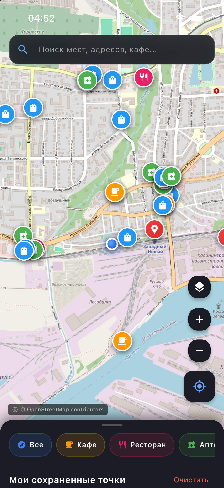
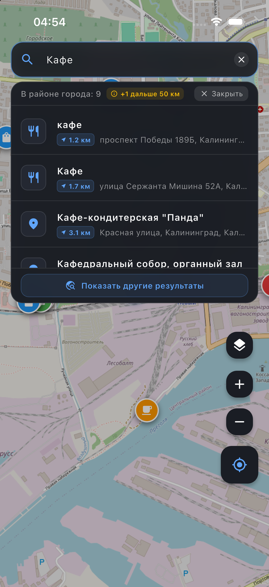
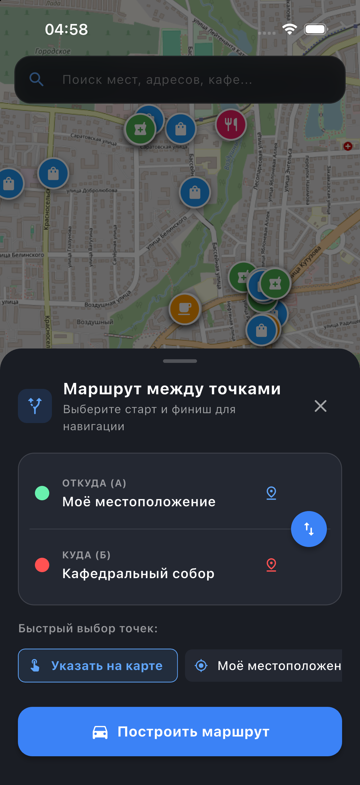
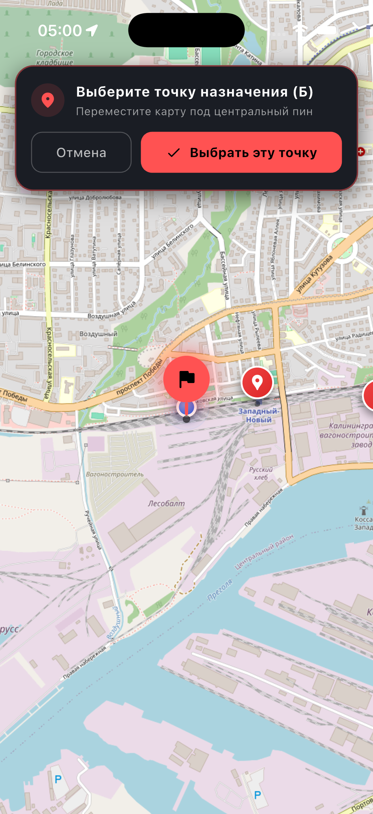
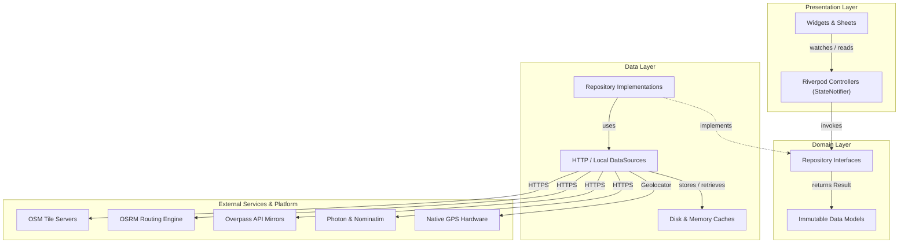

# Maps — Cross-Platform Flutter Navigation & Mapping Application

[](https://github.com/helltrilla/maps/actions/workflows/ci.yml)
[](https://flutter.dev)
[](https://dart.dev)
[](https://flutter.dev)
[](LICENSE)

[Документация на русском языке (Russian version)](README.ru.md)

A production-grade mobile mapping and navigation application built with Flutter, OpenStreetMap, OSRM, Overpass API, and Photon Geocoding. Designed with a clean feature-first architecture, Riverpod state management, comprehensive test coverage, and a configurable backend infrastructure suitable for commercial deployment.

---

## Interface Screenshots

| Map & POIs | Proximity Search | Place Details | Route Planning | Point Picker |
|:---:|:---:|:---:|:---:|:---:|
|  |  |  |  |  |

---

## Key Features

- **Real-Time GPS Tracking & Bearing**:
  - Continuous position stream with accuracy filters and heading orientation cone.
  - Interactive auto-follow camera mode with smooth gestures and manual drag detachment.
- **Deep Zoom with Overzoom Interpolation**:
  - Smooth zooming up to level 22 without 404 tile errors or grey gaps using `maxNativeZoom` upscaling.
- **Proximity-Aware Geocoding & Address Search**:
  - Photon geocoding queries prioritized by user coordinates with automatic fallback to Nominatim.
  - **Strict city-area filtering**: Primary search results strictly present places in the city area up to 50 km (`<= 50km`).
  - **Inter-regional results on demand**: Distant matches (> 50 km) are neatly organized behind a dedicated *"Show other results"* action with real-time distance indicators (`+N further than 50 km`), requesting up to 25 broader results with coordinate deduplication.
  - Helpful empty-state guidance when matches exist only in distant regions.
  - Request debouncing and cancellation tokens to prevent asynchronous race conditions.
  - Quick category shortcuts (Cafes, Restaurants, Pharmacies, Shops, Fuel).
- **Turn-by-Turn Route Calculation (A to B)**:
  - OSRM automotive routing with detailed geometry, travel distance, and estimated duration.
  - Flexible route waypoints: GPS location, searched POIs, saved bookmarks, or interactive map coordinate picker.
  - Instant one-tap route direction reversal.
- **Multi-Source Map Layers & Overflow-Proof Adaptive Sheets**:
  - 5 pre-configured base layers: OpenStreetMap Standard, Esri World Imagery, CyclOSM, OpenTopoMap, and CartoDB Dark.
  - Scroll-controlled modal layer switcher and adaptive sheets guaranteed against `RenderFlex` overflows across all device widths.
  - Disk-backed tile caching powered by `flutter_map_cache` and `dio_cache_interceptor`.
  - Prominent interactive attribution widget for tile license compliance.
- **Infrastructure Exploration via Overpass API**:
  - Dynamic POI loading by bounding box with multi-mirror automatic failover on 504 timeouts.
  - Place detail sheets displaying addresses, phone numbers, opening hours, real photos, and modular demonstration review fixtures.

---

## Architecture

The project adheres to **Feature-First Clean Architecture** principles, maintaining strict separation of concerns, dependency inversion, and predictable state flow managed by **Riverpod**:



### Directory Structure

```text
lib/
├── core/                              # Global infrastructure and utilities
│   ├── config/                        # AppConfig with --dart-define overrides
│   ├── constants/                     # AppConstants, AppStrings, map layer constants
│   ├── errors/                        # Failures, exceptions, and Result monad
│   ├── network/                       # Shared HTTP client utilities
│   └── theme/                         # AppTheme and design tokens
│
├── features/                          # Feature modules
│   ├── map/                           # Base map controller, tile layers, attribution
│   │   ├── domain/                    # Tile style models
│   │   └── presentation/              # MainScreen, MapAttributionWidget, markers
│   ├── markers/                       # Custom user pins and bookmarking
│   │   ├── data/                      # SharedPreferences repository & migration
│   │   ├── domain/                    # SavedMarker models and repository interface
│   │   └── presentation/              # MarkersController
│   ├── places/                        # Overpass POI infrastructure
│   │   ├── data/                      # OverpassDataSource with mirror failover
│   │   ├── domain/                    # Place and PlaceReview models
│   │   └── presentation/              # PlacesController, PlaceDetailsSheet
│   ├── routing/                       # OSRM path calculation
│   │   ├── data/                      # OsrmDataSource
│   │   ├── domain/                    # RouteInfo models and router interface
│   │   └── presentation/              # RoutingController, RoutePlannerSheet
│   └── search/                        # Photon & Nominatim geocoding
│       ├── data/                      # PhotonDataSource with Nominatim fallback
│       ├── domain/                    # SearchResult models and search interface
│       └── presentation/              # SearchController, FloatingSearchBar
│
├── main.dart                          # Application entry point with ProviderScope
└── main_screen.dart                   # Composition coordinator (~420 lines)
```

---

## Configuration & Environment Variables

All external service endpoints are centralized in [`lib/core/config/app_config.dart`](file:///Users/helltrilla/flutter/maps/maps/lib/core/config/app_config.dart) and can be overridden during build or runtime via `--dart-define`:

| Variable | Default Value | Description |
|:---|:---|:---|
| `USER_AGENT_PACKAGE_NAME` | `com.helltrilla.maps` | Package name sent in OSM tile request headers |
| `APP_USER_AGENT` | `MapsApp/1.0 (+https://github.com/helltrilla/maps)` | User-Agent string sent in API queries |
| `OSRM_BASE_URL` | `https://router.project-osrm.org/route/v1/driving` | OSRM routing server endpoint |
| `PHOTON_BASE_URL` | `https://photon.komoot.io/api` | Primary Photon search API |
| `NOMINATIM_BASE_URL` | `https://nominatim.openstreetmap.org` | Fallback Nominatim geocoding endpoint |
| `OVERPASS_MIRRORS` | `https://overpass-api.de/api,https://lz4.overpass-api.de/api,https://z.overpass-api.de/api` | Comma-separated list of Overpass API mirrors |
| `CUSTOM_TILE_URL` | `""` | Optional private tile server URL template |
| `UNSPLASH_ACCESS_KEY` | `""` | Optional Unsplash API key for dynamic place photos |

### Example: Running with Custom Backend

```bash
flutter run \
  --dart-define=OSRM_BASE_URL=https://my-routing-server.example.com/route/v1/driving \
  --dart-define=PHOTON_BASE_URL=https://my-search.example.com/api \
  --dart-define=USER_AGENT_PACKAGE_NAME=com.company.maps
```

---

## Quick Start

### Prerequisites
- [Flutter SDK](https://docs.flutter.dev/get-started/install) (>= 3.24.0)
- [Dart SDK](https://dart.dev) (>= 3.5.0)
- macOS with Xcode (for iOS builds) or Android Studio with Android SDK (API 34)

### Installation

1. **Clone the repository**:
   ```bash
   git clone https://github.com/helltrilla/maps.git
   cd maps
   ```

2. **Install project dependencies**:
   ```bash
   flutter pub get
   ```

3. **Verify code quality & analyze**:
   ```bash
   dart format --output=none --set-exit-if-changed .
   flutter analyze --fatal-infos
   ```

4. **Run automated test suite**:
   ```bash
   flutter test --coverage
   ```

5. **Launch the application**:
   ```bash
   flutter run
   ```

---

## Testing & Quality Assurance

The codebase includes an extensive suite of **34 automated tests** verifying business logic, error boundaries, failover mechanisms, and user interactions:

- **Data Source Unit Tests (`test/features/`)**:
  - HTTP mock testing via `package:http/testing.dart` (`MockClient`).
  - Network timeouts, HTTP 504 server errors, empty responses, and malformed payload handling.
  - Multi-mirror failover verification for Overpass API.
  - Automatic fallback from Photon to Nominatim upon service degradation.
  - Legacy SharedPreferences data migration verification.
- **Widget Tests (`test/widgets/`)**:
  - `MapAttributionWidget`: Modal license view and link behavior.
  - `FloatingSearchBar`: Category interactions, query execution, layout safety, strict `<= 50 km` city-area filtering, and on-demand inter-regional results expansion.
  - `PlaceDetailsSheet`: Detail presentation, demo indicators, and route callbacks without layout overflows.
  - `RoutePlannerSheet`: Waypoint swap, custom point selection, and validation.
  - `MainScreen`: Initial frame mounting and integration smoke test.
- **Continuous Integration**:
  - GitHub Actions workflow (`.github/workflows/ci.yml`) runs on every commit and pull request.

---

## Limitations & Production Roadmap

- **Public API Rate Limits**: Default endpoints (OSRM, Overpass, Photon, OSM tiles) use community-hosted servers with strict Fair Use Policies. For commercial production workloads, hosting dedicated instances is required. Refer to [docs/PROVIDERS_AND_LICENSES.md](docs/PROVIDERS_AND_LICENSES.md) for self-hosting guides.
- **Vector Tiles & Offline Maps**: Current implementation relies on raster tiles with local HTTP caching. A planned enhancement is vector tile rendering (`MVT`) and bundled offline regions (`MBTiles`).
- **Turn-by-Turn Voice Navigation**: The app currently generates route polylines and step data; full real-time speech guidance can be integrated using platform text-to-speech engines.

## Release & Handover Guide

Detailed instructions for project transfer, bundle ID customization, keystore generation, and release build commands (APK, AAB, IPA) are provided in:
📄 **[docs/HANDOVER_CHECKLIST.md](docs/HANDOVER_CHECKLIST.md)**

---

## Providers & Licenses Compliance

Detailed terms of service, attribution requirements, rate limits, and guidelines for production transitions are documented in:
📄 **[docs/PROVIDERS_AND_LICENSES.md](docs/PROVIDERS_AND_LICENSES.md)**

All map data is &copy; [OpenStreetMap contributors](https://www.openstreetmap.org/copyright).

---

## License

This project is licensed under the **MIT License** — see the [LICENSE](LICENSE) file for details.

The MIT License grants permission for commercial use, private use, modification, distribution, and resale without warranty.
