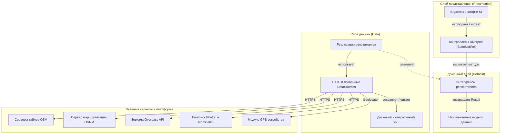

# Maps — Кроссплатформенное приложение карт и навигации на Flutter

[](https://github.com/helltrilla/maps/actions/workflows/ci.yml)
[](https://flutter.dev)
[](https://dart.dev)
[](https://flutter.dev)
[](LICENSE)

[English documentation](README.md)

Высокопроизводительное кроссплатформенное мобильное приложение для работы с картами и навигацией, разработанное на стеке Flutter, OpenStreetMap, OSRM, Overpass API и Photon Geocoding. Архитектура построена по принципам Feature-First Clean Architecture с управлением состоянием через Riverpod, комплексным тестовым покрытием и гибкой конфигурацией бэкенда для коммерческого использования.

---

## Скриншоты интерфейса

| Карта и POI | Поиск рядом (GPS) | Карточка заведения | Маршруты (А ➔ Б) | Выбор на карте |
|:---:|:---:|:---:|:---:|:---:|
|  |  |  |  |  |

---

## Ключевые возможности

- **Отслеживание геолокации и направления движения в реальном времени**:
  - Непрерывный стрим координат с фильтрацией погрешностей и отображением конуса направления взгляда/движения.
  - Режим плавного автоследования камеры за пользователем с мягким отключением при ручном сдвиге карты.
- **Глубокий зум без разрывов («Overzoom Engine»)**:
  - Приближение вплоть до 22-го уровня масштабирования без ошибок 404 и серых тайлов благодаря интерполяции `maxNativeZoom`.
- **Геопоиск с приоритетом ближайших объектов**:
  - Поиск адресов и заведений через Photon API с привязкой к текущим координатам и автоматическим фолбэком на Nominatim при сбоях.
  - **Строгая фильтрация районом города**: в основной поисковой выдаче отображаются только объекты в радиусе города до 50 км (`<= 50 км`).
  - **Межрегиональные результаты по запросу**: удаленные места (> 50 км) скрыты за интерактивной кнопкой «*Показать другие результаты*» с индикатором расстояния (`+N дальше 50 км`), автоматическим расширенным запросом до 25 результатов и дедупликацией по координатам.
  - Информативное пустое состояние при отсутствии совпадений в городе («В районе города ничего не найдено, найдено дальше 50 км: N»).
  - Дебаунс запросов и отмена устаревших токенов поиска для защиты от race conditions.
  - Быстрый доступ к популярным категориям (Кафе, Рестораны, Аптеки, Магазины, АЗС).
- **Построение маршрутов (А ➔ Б)**:
  - Автомобильная маршрутизация OSRM с расчетом полилинии, километража и времени в пути.
  - Любые комбинации точек: текущая позиция GPS, найденные заведения, сохранённые закладки или произвольная точка, выбранная на карте.
  - Моментальный реверс точек маршрута одной кнопкой (Swap ⇄).
- **Несколько слоев карты и адаптивные шторки**:
  - 5 предустановленных стилей карты: OpenStreetMap Standard, Esri World Imagery (спутник), CyclOSM, OpenTopoMap и CartoDB Dark.
  - Модальный переключатель слоев и адаптивные шторки, полностью защищенные от переполнений `RenderFlex` на экранах любой ширины.
  - Оффлайн-кэширование тайлов на диск с помощью `flutter_map_cache` и `dio_cache_interceptor`.
  - Интерактивный виджет обязательной атрибуции и соблюдения лицензий поставщиков тайлов.
- **Исследование городской инфраструктуры (Overpass API)**:
  - Загрузка объектов городской среды в текущей видимой области карты с автоматическим переключением между зеркалами при HTTP 504.
  - Карточки мест с отображением адреса, телефона, времени работы, фотографий и демонстрационными фикстурами отзывов.

---

## Архитектура проекта

Проект организован по модульному принципу **Feature-First Clean Architecture** со строгим разделением ответственности и управлением состоянием через **Riverpod**:



### Структура директорий

```text
lib/
├── core/                              # Общая инфраструктура и утилиты
│   ├── config/                        # AppConfig с поддержкой флагов --dart-define
│   ├── constants/                     # Константы приложения, тексты UI, стили слоев
│   ├── errors/                        # Иерархия ошибок Failures, Exceptions и монада Result
│   ├── network/                       # Утилиты HTTP-клиента
│   └── theme/                         # AppTheme и дизайн-токены
│
├── features/                          # Функциональные модули
│   ├── map/                           # Контроллер базовой карты, слои тайлов, атрибуция
│   │   ├── domain/                    # Модели стилей карты
│   │   └── presentation/              # MainScreen, MapAttributionWidget, маркеры
│   ├── markers/                       # Пользовательские метки и закладки
│   │   ├── data/                      # SharedPreferences репозиторий с миграцией данных
│   │   ├── domain/                    # Модели SavedMarker и интерфейс репозитория
│   │   └── presentation/              # MarkersController
│   ├── places/                        # Инфраструктура заведений через Overpass API
│   │   ├── data/                      # OverpassDataSource с пулом зеркал
│   │   ├── domain/                    # Модели Place, PlaceReview
│   │   └── presentation/              # PlacesController, PlaceDetailsSheet
│   ├── routing/                       # Автомобильные маршруты через OSRM
│   │   ├── data/                      # OsrmDataSource
│   │   ├── domain/                    # Модели RouteInfo и интерфейс маршрутизатора
│   │   └── presentation/              # RoutingController, RoutePlannerSheet
│   └── search/                        # Геопоиск через Photon и Nominatim
│       ├── data/                      # PhotonDataSource с резервным каналом Nominatim
│       ├── domain/                    # Модели SearchResult и интерфейс поисковика
│       └── presentation/              # SearchController, FloatingSearchBar
│
├── main.dart                          # Точка входа в приложение с ProviderScope
└── main_screen.dart                   # Координатор композиции экранов (~420 строк)
```

---

## Конфигурация и переменные окружения

Все внешние сервисы и их URL-адреса собраны в [`lib/core/config/app_config.dart`](file:///Users/helltrilla/flutter/maps/maps/lib/core/config/app_config.dart) и могут быть переопределены на этапе сборки с помощью `--dart-define`:

| Переменная | Значение по умолчанию | Описание |
|:---|:---|:---|
| `USER_AGENT_PACKAGE_NAME` | `com.helltrilla.maps` | Имя пакета в заголовках запросов тайлов OSM |
| `APP_USER_AGENT` | `MapsApp/1.0 (+https://github.com/helltrilla/maps)` | Строка User-Agent для сетевых запросов к API |
| `OSRM_BASE_URL` | `https://router.project-osrm.org/route/v1/driving` | URL сервера маршрутизации OSRM |
| `PHOTON_BASE_URL` | `https://photon.komoot.io/api` | Основной сервис геопоиска Photon |
| `NOMINATIM_BASE_URL` | `https://nominatim.openstreetmap.org` | Резервный сервис геопоиска Nominatim |
| `OVERPASS_MIRRORS` | `https://overpass-api.de/api,https://lz4.overpass-api.de/api,https://z.overpass-api.de/api` | Список зеркал Overpass API через запятую |
| `CUSTOM_TILE_URL` | `""` | Шаблон URL собственного сервера тайлов |
| `UNSPLASH_ACCESS_KEY` | `""` | Опциональный ключ Unsplash для фото мест |

### Пример запуска со своим сервером

```bash
flutter run \
  --dart-define=OSRM_BASE_URL=https://my-routing-server.example.com/route/v1/driving \
  --dart-define=PHOTON_BASE_URL=https://my-search.example.com/api \
  --dart-define=USER_AGENT_PACKAGE_NAME=com.company.maps
```

---

## Быстрый старт

### Системные требования
- [Flutter SDK](https://docs.flutter.dev/get-started/install) (>= 3.24.0)
- [Dart SDK](https://dart.dev) (>= 3.5.0)
- macOS с Xcode (для запуска на iOS) или Android Studio с Android SDK (API 34)

### Установка и запуск

1. **Клонируйте репозиторий**:
   ```bash
   git clone https://github.com/helltrilla/maps.git
   cd maps
   ```

2. **Установите зависимости**:
   ```bash
   flutter pub get
   ```

3. **Проверьте форматирование и статический анализ**:
   ```bash
   dart format --output=none --set-exit-if-changed .
   flutter analyze --fatal-infos
   ```

4. **Запустите автоматические тесты**:
   ```bash
   flutter test --coverage
   ```

5. **Запустите приложение**:
   ```bash
   flutter run
   ```

---

## Тестирование и контроль качества

В репозитории настроен расширенный набор из **34 автоматизированных тестов**, покрывающий бизнес-логику, обработку сбоев, сценарии переключения зеркал и интерфейс:

- **Юнит-тесты источников данных (`test/features/`)**:
  - Изолированное мокирование HTTP-ответов через `package:http/testing.dart` (`MockClient`).
  - Проверка сценариев таймаута сети, ошибки 504 Gateway Timeout, пустого ответа сервера.
  - Тестирование механизма автоматической смены зеркал Overpass API при недоступности основного сервера.
  - Тестирование резервного переключения с Photon на Nominatim.
  - Проверка сохранения и миграции данных в `SharedPreferences`.
- **Виджет-тесты (`test/widgets/`)**:
  - `MapAttributionWidget`: показ копирайта и открытие диалога с условиями лицензий.
  - `FloatingSearchBar`: взаимодействие с поисковой строкой, категориями, безопасный рендеринг, строгая фильтрация в пределах 50 км и раскрытие загородных мест.
  - `PlaceDetailsSheet`: отображение карточки места, бейджей демо-режима, колбэков маршрута и адаптивная верстка без оверфловов.
  - `RoutePlannerSheet`: смена начальной/конечной точки местами, выбор точек и валидация.
  - `MainScreen`: монтирование главного экрана и начальный кадр без сбоев.
- **Непрерывная интеграция (CI)**:
  - Автоматизированный workflow GitHub Actions (`.github/workflows/ci.yml`) запускается при каждом коммите и пул-реквесте.

---

## Ограничения и планы развития

- **Лимиты публичных API**: По умолчанию приложение настроено на открытые серверы сообщества (OSRM, Overpass, Photon, тайлы OSM), которые имеют строгие правила Fair Use Policy. Для промышленной эксплуатации необходимо развернуть собственные экземпляры сервисов. Подробная инструкция приведена в [docs/PROVIDERS_AND_LICENSES.md](docs/PROVIDERS_AND_LICENSES.md).
- **Векторные тайлы и оффлайн-карты**: В текущей версии используются растровые тайлы с локальным HTTP-кэшированием. Запланирована интеграция векторных карт (`MVT`) и оффлайн-пакетов регионов (`MBTiles`).
- **Пошаговое голосовое ведение**: Рассчитывается геометрия маршрута и список маневров; голосовые подсказки могут быть подключены через платформенный модуль TTS.

## Руководство по передаче и релизной сборке

Подробные инструкции по смене Bundle ID под вашу компанию, генерации ключей подписи (Keystore / Apple Certificate), сборке релизных пакетов (APK, AAB, IPA) и передаче прав новому владельцу приведены в:
📄 **[docs/HANDOVER_CHECKLIST.md](docs/HANDOVER_CHECKLIST.md)**

---

## Провайдеры данных и лицензии

Условия использования, правила атрибуции, лимиты запросов и руководство по переводу приложения в продакшн описаны в документе:
📄 **[docs/PROVIDERS_AND_LICENSES.md](docs/PROVIDERS_AND_LICENSES.md)**

Все картографические данные &copy; [участники OpenStreetMap](https://www.openstreetmap.org/copyright).

---

## Лицензия

Проект распространяется под открытой лицензией **MIT** — подробности в файле [LICENSE](LICENSE).

Лицензия MIT разрешает свободное коммерческое использование, модификацию, интеграцию в закрытые решения и перепродажу без каких-либо роялти и ограничений.
